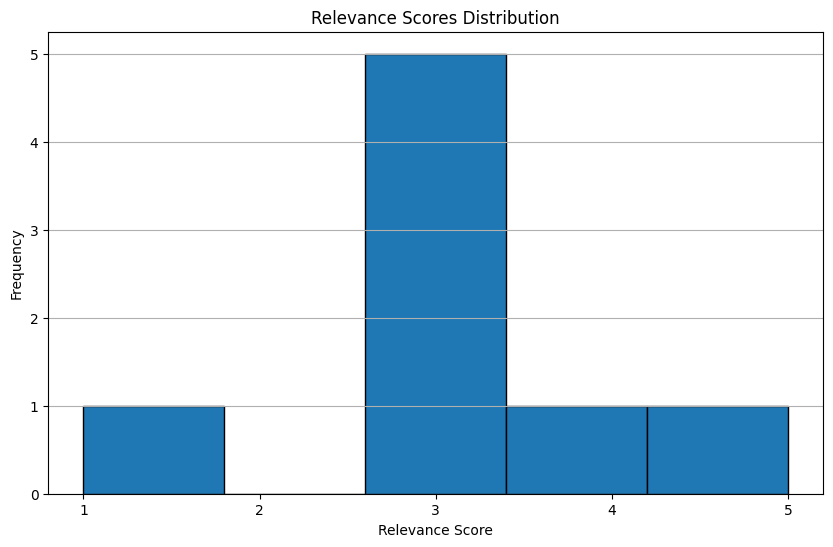
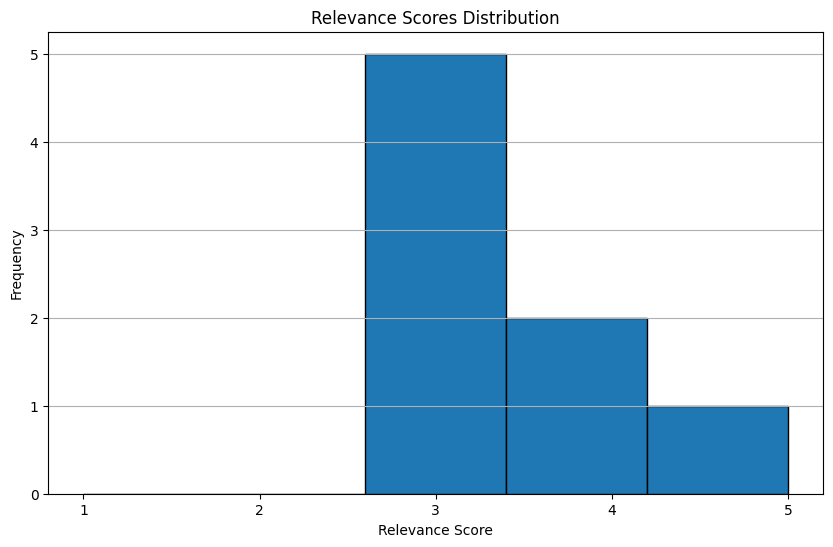
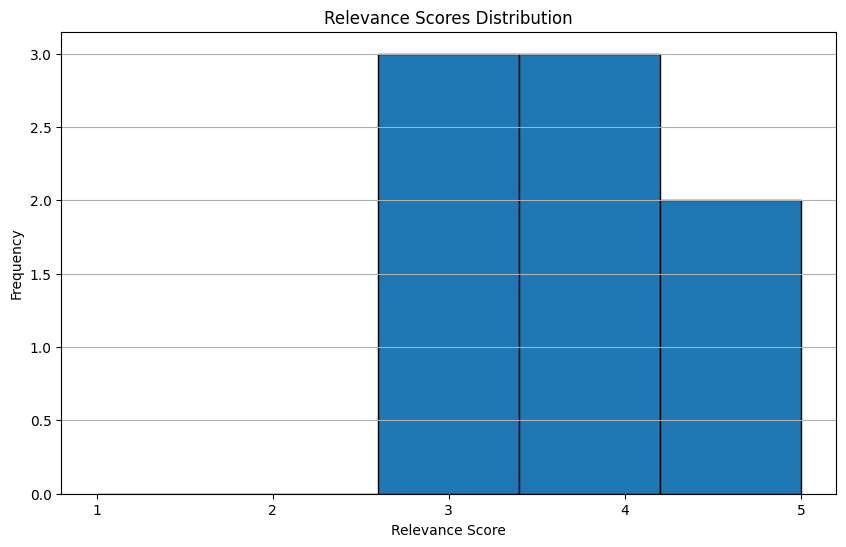
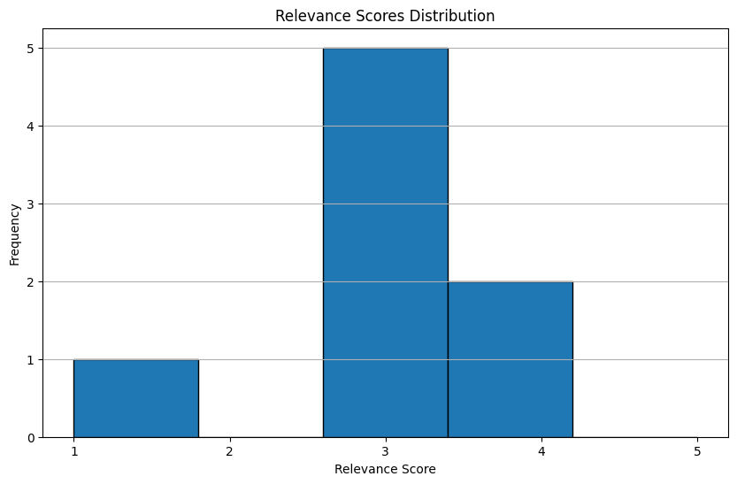

# RAG Optimization 2차

## 실험 데이터 

### 액셀데이터 추출기준

* 파일: "대화이력_피드백내역_9월_v0.65_20241015" > GI+RAG_1015 
* 필터
  * Language_cd = en
  * Type = RAG
  * 유형 = 검색
  * Status = InProgress-HQ

### 데이터 선정

* 51건 queries_all.json

* 임베딩2, 3 모델로 Relevance Score 4점 이하 질문들: queries_low_score2.json (8건)
    * 이 데이터를 개선하는 것을 목표로 함.

* 베이스라인 스코어

## Embedding 모델 변경

* embedding3 large model로 변경

## 하이브리드(BM25 + Vector) + 시맨틱 리랭킹 w embedding large3

## Query Rewrite, 하이브리드, 시맨틱 리랭킹 w embed3

## 결론

2차 검증은 `text-embedding-3-large`으로 벡터검색을 수행하고 하이브리드 + 시맨틱 리랭킹을 수행하였을때 Relevance Score가 향상되는 것으로 확인됨.

